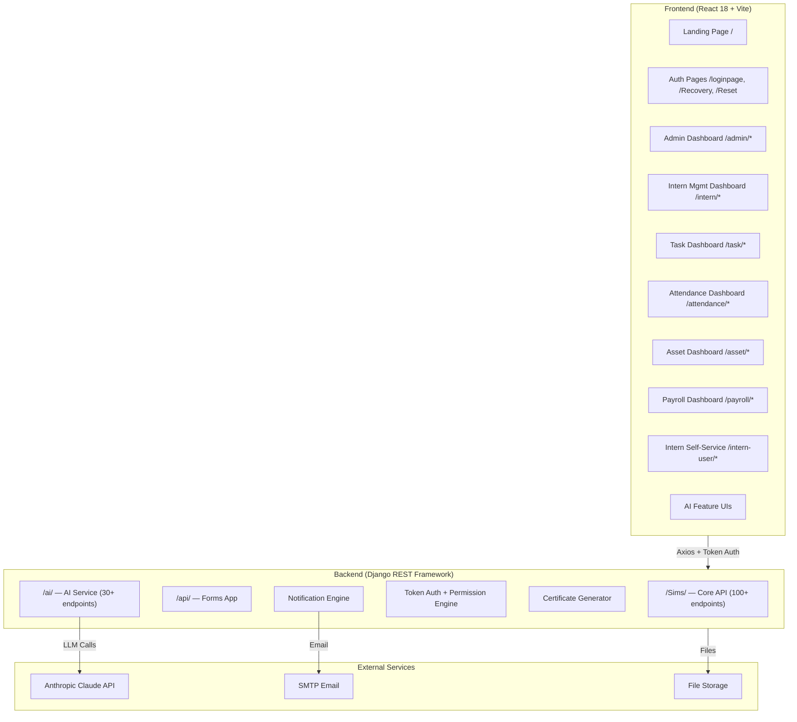

# SIMS — Student Intern Management System — Complete Implementation Plan

> [!SUCCESS]
> **IMPLEMENTATION COMPLETE**
> All 10 phases of this implementation plan have been successfully executed. The full-stack, AI-augmented web application acting as a lightweight ERP for managing the complete intern lifecycle is now fully built and the frontend compilation passes.

A full-stack, AI-augmented web application acting as a lightweight ERP for managing the complete intern lifecycle. Multi-entity, role-based, with 16+ AI features powered by Claude API.

---

## User Review Required

> [!NOTE]
> **This was a 77-page spec with 200+ API endpoints, 60+ pages/components, 16 AI features, and 6 dashboard shells.** It has been executed in **10 phases**. Each phase produced a working, testable increment.

> [!WARNING]
> **Tech Stack Confirmation Needed:**
> - **Frontend**: React 18 + Vite + MUI v6 + Tailwind CSS v4 + React Router v7
> - **Backend**: Django 5 + Django REST Framework + SQLite (dev) / PostgreSQL (prod)
> - **AI Layer**: Anthropic Claude API (claude-sonnet-4-5) + LangChain
> - **State**: React hooks (useState/useEffect) + Context — NO Redux/Zustand
> - Is this stack confirmed? Any changes?

> [!CAUTION]
> **API Keys Required:**
> - Anthropic Claude API key (for AI features)
> - SMTP credentials (for email notifications/OTP)
> - These will be configured via `.env` files — you'll need to provide them before AI features and email work.

---

## Open Questions

> [!IMPORTANT]
> 1. **Database**: SQLite for development, PostgreSQL for production — correct?
> 2. **Deployment target**: Render (as mentioned in spec) or different?
> 3. **Do you have an Anthropic API key** ready, or should I stub AI endpoints initially?
> 4. **Email service**: Gmail SMTP, SendGrid, or another provider for OTP/notifications?
> 5. **File storage**: Local filesystem (dev) or cloud (S3/GCS) for document uploads?

---

## Architecture Overview



---

## Proposed Changes — Phased Execution

### Phase 1: Project Scaffolding & Core Infrastructure
**Estimated: Foundation layer — everything else depends on this**

---

#### Backend Foundation

##### [NEW] `backend/` — Django Project Root
- Django 5 project with `sims_project/` settings
- `sims/` app — core CRUD models, serializers, views
- `ai_service/` app — AI feature endpoints
- `forms_app/` app — Forms & surveys module

##### [NEW] `backend/sims_project/settings.py`
- Django settings with DRF config, CORS, token auth, media/static files
- Environment variables via `python-dotenv`

##### [NEW] `backend/sims/models.py` — Complete Data Models
All models from spec Section 27:

| Model | Key Fields | Relations |
|-------|-----------|-----------|
| **Entity** | name, is_active | → Branch, Department |
| **Branch** | name, entity | FK → Entity |
| **Department** | name, branch | FK → Branch |
| **Domain** | name, department | FK → Department |
| **UserProfile** | emp_id, role, user_status, scheme, shift_timing, photo, is_deleted | FK → Entity, Department, Domain |
| **Team** | name, mentor (team lead) | FK → UserProfile, M2M interns |
| **Project** | name, description, domain, start/end dates | FK → Domain, Team |
| **Task** | title, description, status, priority, task_type, progress, sla_hours, blocked_by | FK → UserProfile, Project, self |
| **Subtask** | title, status | FK → Task |
| **AttendanceRecord** | date, check_in, check_out, break_start, break_end, total_hours, status | FK → UserProfile |
| **LeaveRequest** | leave_type, start_date, end_date, reason, status, approver_comment | FK → UserProfile |
| **AttendanceClaim** | date, reason, status, reviewer_comment | FK → UserProfile |
| **Asset** | asset_code, asset_type, serial_number, condition, status, assigned_to, issue_date, expected_return_date, is_deleted | FK → UserProfile |
| **AssetIssue** | asset, description, reported_by | FK → Asset, UserProfile |
| **PaymentRecord** | amount, status, payment_mode, payment_date, scheme | FK → UserProfile |
| **FeeStructure** | name, amount, entity, scheme | FK → Entity |
| **Document** | doc_type, file, status, reviewer_comment, version | FK → UserProfile |
| **Feedback** | intern, reviewer, qualitative_notes, scores, recommendation | FK → UserProfile × 2 |
| **OnboardingSubmission** | all personal/academic/internship fields, status | — |
| **Notification** | user, message, type, is_read, priority | FK → UserProfile |
| **ActivityLog** | user, table_name, action, old_data, new_data, timestamp | FK → UserProfile |
| **ProfileUpdateRequest** | user, field_changes, status | FK → UserProfile |
| **EntityConfig** | entity, working_hours, leave_policy, payment_cycle, feature_flags, sla_defaults, upload_restrictions | FK → Entity |
| **RoleDelegation** | delegator, delegate, permissions, start_date, end_date, is_active | FK → UserProfile × 2 |
| **Certificate** | intern, cert_type, file, generated_at | FK → UserProfile |
| **Promotion** | intern, from_scheme, to_scheme, approved_by, date, basis | FK → UserProfile × 2 |

##### [NEW] `backend/sims/serializers.py`
- ModelSerializers for all models with nested representations
- Validation logic (field validation, uniqueness, business rules)

##### [NEW] `backend/sims/permissions.py`
- `IsSuperAdmin`, `IsManager`, `IsLeadOrAbove`, `IsMentorOrAbove`, `IsIntern`
- `EntityScopedPermission` — filters querysets by user's entity
- `DomainScopedPermission` — filters by user's domain (for Leads)
- `AssignedInternPermission` — filters by mentor's assigned interns
- Dashboard access flags: `hasInternAccess`, `hasAssetAccess`, `hasAttendanceAccess`, `hasPayrollAccess`

##### [NEW] `backend/sims/views/auth_views.py`
- `LoginView` — POST /Sims/login/ → returns Token
- `LogoutView` — POST /Sims/logout/ → invalidates token
- `RegisterView` — POST /Sims/register/
- `PasswordResetRequestView` — POST /Sims/password-reset/request/ (sends OTP)
- `PasswordResetVerifyView` — POST /Sims/password-reset/verify/
- `PasswordResetUpdateView` — POST /Sims/password-reset/update/
- `UserPermissionsView` — GET /Sims/user-permissions/
- `CurrentUserView` — GET /Sims/me/

##### [NEW] `backend/sims/views/` — All CRUD ViewSets
Split into logical files:
- `user_views.py` — Users, Interns, Staff, Profiles, Onboarding
- `org_views.py` — Entities, Branches, Departments, Domains
- `attendance_views.py` — Check-in/out, Breaks, Leave, Claims, Analysis
- `task_views.py` — Tasks, Projects, Teams, Completion Review
- `asset_views.py` — Assets, Issues, History
- `payment_views.py` — Fees, Fee Structures
- `document_views.py` — Documents, Approval
- `feedback_views.py` — Feedback, Performance
- `notification_views.py` — Notifications
- `certificate_views.py` — All certificate generation
- `dashboard_views.py` — Admin dashboard summary, Reports
- `log_views.py` — Activity logs

##### [NEW] `backend/sims/urls.py`
- All 100+ `/Sims/` endpoints registered

##### [NEW] `backend/forms_app/` — Forms & Surveys Module
- Models: Form, FormSection, FormQuestion, FormResponse, ResponseComment
- Views: CRUD, public submission, analytics, consult flag, comments
- URLs: All `/api/` endpoints

---

#### Frontend Foundation

##### [NEW] `frontend/` — React 18 + Vite Project
```
frontend/
├── public/
├── src/
│   ├── assets/          # Images, icons
│   ├── components/      # Shared UI components
│   │   ├── layout/      # Header, Sidebar, Footer
│   │   ├── common/      # Buttons, Chips, Badges, Loaders
│   │   ├── charts/      # Chart wrappers
│   │   └── ai/          # AI-specific components
│   ├── contexts/        # ThemeContext, AuthContext, LanguageContext
│   ├── hooks/           # Custom hooks
│   ├── pages/           # All page components
│   │   ├── public/      # Landing, Login, Recovery, Reset, About, Contact
│   │   ├── admin/       # Admin Dashboard shell + sub-pages
│   │   ├── intern-mgmt/ # Intern Management Dashboard
│   │   ├── task/        # Task Dashboard
│   │   ├── attendance/  # Attendance Dashboard
│   │   ├── asset/       # Asset Dashboard
│   │   ├── payroll/     # Payroll Dashboard
│   │   └── intern-user/ # Intern Self-Service Dashboard
│   ├── services/        # API service modules (api.js + named modules)
│   ├── utils/           # Helpers, formatters, validators
│   ├── App.jsx          # Root with Router
│   ├── main.jsx         # Entry point
│   └── index.css        # Tailwind + global styles
├── tailwind.config.js
├── vite.config.js
└── package.json
```

##### [NEW] `frontend/src/services/api.js`
- Centralized Axios instance with:
  - Token attachment on every request
  - Global 401 interceptor → clear localStorage → redirect to /loginpage
  - 30-second timeout
  - Named API modules: `authAPI`, `usersAPI`, `tasksAPI`, `attendanceAPI`, `assetsAPI`, `feesAPI`, `documentsAPI`, `certificatesAPI`, `feedbackAPI`, `notificationsAPI`, `formsAPI`, `dashboardAPI`, `aiAPI`

##### [NEW] `frontend/src/contexts/`
- `AuthContext.jsx` — token, username, role, login/logout functions
- `ThemeContext.jsx` — dark/light mode toggle, persisted to profile
- `LanguageContext.jsx` — multilingual UI support

##### [NEW] `frontend/src/components/layout/`
- `Header.jsx` — 64px fixed header with logo, user avatar, notification bell, dark mode toggle, global search
- `Sidebar.jsx` — 240px fixed sidebar, collapsible on mobile, role-based menu items
- `DashboardShell.jsx` — Reusable shell: Header + Sidebar + scrollable content area
- `ProtectedRoute.jsx` — checks token presence
- `ProtectedDashboardRoute.jsx` — checks token + calls /Sims/user-permissions/ + redirects

---

### Phase 2: Authentication & Public Pages
**All auth flows + stunning public landing page**

---

##### [NEW] Public Pages
- `InternHomePage.jsx` — `/` — Hero slider, features grid, about section, contact, program banner. **Premium glassmorphism design with animations (Framer Motion)**
- `LoginPage.jsx` — `/loginpage` — Login form with MUI, dark/light support, animated transitions
- `Recovery.jsx` — `/Recovery` — OTP request page
- `Reset.jsx` — `/Reset` — OTP verify + new password page
- `AboutUs1.jsx` — `/AboutUs1` — Public about page
- `ContactUs1.jsx` — `/ContactUs1` — Public contact page
- `PublicFeedbackForm.jsx` — `/feedback/:formId` — Public form submission (no auth)

##### Auth Backend
- Complete login/logout/register/password-reset flow
- Token generation + validation
- MFA (TOTP) for Manager+ roles
- Session management (active sessions, force logout)
- Password complexity validation

---

### Phase 3: Admin Dashboard & Entity Management
**Super Admin + Manager views — the control center**

---

##### [NEW] Admin Dashboard Shell (`/admin/*`)
- `AdminDashboard.jsx` — Shell with sidebar: Dashboard, Staff, Interns, Payments, Departments, Entities, Feedback, Teams, Register, Profile
- `AdminDashboardContent.jsx` — `/admin/dashboard`
  - Summary cards: Total Interns, Active, Completed, Yet to Join, On Leave, Discontinued
  - Attendance % for selected date
  - Payment summary: Completed, Pending, Overdue, Free
  - Department distribution bar chart
  - Date picker filter
  - API: `GET /Sims/admin/dashboard-summary/?date={YYYY-MM-DD}`

##### [NEW] Entity & Org Management
- `EntityManagement.jsx` — `/admin/entities` — Entity, Branch, Entity-Department CRUD
- `DepartmentManagement.jsx` — `/admin/departments` — Department and Domain CRUD with hierarchy visualization

##### [NEW] User Management
- `StaffList.jsx` — `/admin/user` — Staff table with view/edit/deactivate, filter by dept/role/status
- `RegisterPage.jsx` — `/admin/register` — Staff registration form
- `InternLists.jsx` — `/admin/interns` — All interns with status filter, CSV export, bulk actions
- `AdminProfile.jsx` — `/admin/profile` — Admin profile management

##### [NEW] Settings & Configuration
- `Settings.jsx` — `/Settings` — Dark mode, language, notifications, password change, profile photo
- `EntityConfig.jsx` — Entity-level settings: shifts, leave policy, payment cycles, feature flags, SLA defaults, upload restrictions, notification templates, AI feature toggles

---

### Phase 4: Intern Onboarding & Lifecycle
**The full intern journey from application to active**

---

##### [NEW] Onboarding
- `InternOnboarding.jsx` — `/InternOnboarding` — Multi-step form:
  1. Personal Details (emp_id, name, email, phone, aadhar, gender, DOB, photo)
  2. Academic Details (reg_no, location, college, degree, dept, year_of_passing)
  3. Internship Details (start/end date, shift, scheme, dept, domain, terms)
- `OnboardingList.jsx` — Manager review with AI Readiness Score
- Approval flow: Enable → Send Credentials → Status → Active

##### [NEW] Profile Management
- `InternProfile.jsx` — Full intern profile view (staff side): personal, academic, internship, documents, assets, payments, lifecycle status
- Profile update request/approval flow
- Promotion modal with pathway: Free → Paid → Stipend → Employee → Mentor/Lead
- Activity Timeline per intern

##### [NEW] Bulk Operations
- `BulkImportWizard.jsx` — `/admin/import` — CSV import with column mapping, validation, duplicate detection, error log
- Bulk status updates, bulk task assignment, bulk asset issue

---

### Phase 5: Attendance & Leave Management
**Check-in/out, breaks, leave, claims, hours calculator**

---

##### [NEW] Intern Attendance (Self-Service)
- Real-time check-in/out widget in `Dash.js` with session timer
- Break start/end tracking
- `AttendanceManagement.jsx` — `/intern-user/attendance` — Check-in/out, attendance log
- `LeaveManagement.jsx` — `/intern-user/leave` — Apply for leave, view history, balance
- `InternHoursCalculator.jsx` — `/intern-user/hours-calculator` — Date range hours calculation

##### [NEW] Attendance Dashboard (Staff)
- `AttendanceDashboard.jsx` — `/attendance/*` — Shell with views:
  - **Dashboard**: Present today, attendance %, on-leave count, date filter
  - **Daily Attendance**: Table with check-in/out times, total hours, status
  - **Attendance Log**: Date-range filtered log
  - **Leave List**: All leave requests with approve/reject
  - **Attendance Claims**: Correction requests with approve/reject
  - **Profile**: Staff profile

##### Shift Configuration
- Entity-level shift definitions (morning, evening, standard, custom)
- Late-mark and half-day rules based on shift + check-in time

---

### Phase 6: Task & Project Management
**Full task lifecycle, projects, teams, Gantt, Kanban**

---

##### [NEW] Task Dashboard Shell (`/task/*`)
- `TaskDashboard.jsx` — Shell with views:
  - **Tasks Dashboard**: Counts by status, monthly trend chart, due-today list, distribution donut
  - **Task List**: Full filterable table, bulk actions, AI suggestion button
  - **Projects**: Project cards with CRUD
  - **Project Status**: Per-project detail with task breakdown, progress bar, Gantt chart
  - **Teams**: Team cards with intern management
  - **Departments**: Department/domain hierarchy
  - **Individual Task**: Deep-dive with subtasks, comments, file attachments
  - **User List**: Users in task context

##### [NEW] Task Components
- `CreateTaskDialog.jsx` — Task creation with all fields + AI suggestions
- `TaskCard.jsx` — Task card with status, priority badge, SLA badge, progress
- `TaskDependencySelector.jsx` — blocked-by multi-select
- `SLABadge.jsx` — Countdown chip with warning/breach states
- `EscalationTimeline.jsx` — Escalation chain status
- `TaskManagerCreation.jsx` — Bulk task creation via spreadsheet grid
- `CompletionReview.jsx` — Task completion review queue
- Kanban board with @dnd-kit drag-and-drop

##### [NEW] Project & Team Management
- Project CRUD with team/lead assignment
- Gantt chart view with dependency visualization
- Team CRUD with intern assignment/removal
- `TeamInternsPage.jsx` — Team intern list

##### [NEW] Intern Task View
- Task cards grouped by status (To Do, In Progress, Completed)
- Due-today tasks highlighted
- Subtask management
- Weekly performance stats, monthly task count trend

---

### Phase 7: Payments, Assets & Documents
**Financial management, asset tracking, document workflow**

---

##### [NEW] Payroll Dashboard (`/payroll/*`)
- Dashboard: Total, pending, completed, overdue counts + trend chart
- Payment Management: Full table with filters, search
- Payment CRUD with approval workflow for cash payments
- Payment cycle configuration
- Fee structure management
- `PaymentStatusPage.jsx` — Intern read-only view

##### [NEW] Asset Dashboard (`/asset/*`)
- Dashboard: Total/available/assigned/damaged/lost counts, monthly trend, type distribution
- Asset Management: Full CRUD table with assign/return
- Intern Status: Which interns have which assets
- Asset Reports: Assignment history, issue log
- Asset lifecycle: Create → Assign → Issue/Return → Verify
- `AssetReport.jsx` — Intern self-service asset view + issue reporting

##### [NEW] Document Management
- `DocumentView.jsx` — Intern document upload (Offer Letter, NDA, Resume, ID, Certificates)
- Upload validation: PDF, JPG, PNG only, size limits
- Approval flow: Pending → Approved/Rejected with comments
- Re-upload for rejected docs with version history
- Document download as blob
- `ApproveDashboard.jsx` — Staff approval dashboard

---

### Phase 8: Feedback, Performance & Certificates
**Evaluation system, forms builder, certificate generation**

---

##### [NEW] Feedback System
- `PerformanceFeedbackPage.jsx` — Mentor periodic feedback with scores
- `PerformanceFeedbackList.jsx` — All feedback submissions
- Lead final evaluation: Selected / Not Selected
- `StudentStaffFeedback.jsx` — Intern-to-staff feedback
- Feedback versioning

##### [NEW] Performance Metrics
- Auto-calculated: Attendance %, Task Completion Rate, Effective Hours Ratio, Quality Rating, Learning Completion %
- `PerformancePage.jsx` — Intern view with charts (line, bar, doughnut, circular progress)

##### [NEW] Forms & Surveys Module
- `Forms.jsx` — Form builder with 8 question types (text, textarea, radio, checkbox, dropdown, email, phone, rating, yes/no)
- Section organization
- `FormResponses.jsx` — Response viewer with consult flag
- `FormAnalytics.jsx` — Response analytics
- Public shareable link (`/feedback/:formId`)

##### [NEW] Certificate Generation (Backend)
- Completion Certificate — POST /Sims/generate-completion-certificate/
- Offer Letter — POST /Sims/generate-offer-letter/
- Task Certificate — POST /Sims/generate-task-certificate/
- Attendance Certificate — POST /Sims/generate-attendance-certificate/
- Partial Completion Certificate — POST /Sims/generate-partial-certificate/
- Server-side PDF generation (ReportLab / WeasyPrint)

---

### Phase 9: Notifications, Reporting & System-Wide Features
**Notifications, audit logs, calendar, exports, search**

---

##### [NEW] Notification System
- In-app notifications with unread count badge
- Email notifications for key events (leave, documents, tasks, SLA, claims)
- Notification preferences per user
- Notification triggers: task assignment, status change, leave status, payment change, document approval/rejection, attendance claim, escalation alerts

##### [NEW] Reporting & Analytics
- Role-based dashboard data aggregation
- CSV/Excel export from all major list views (react-csv)
- Activity/audit log viewer
- `AuditLogPage.jsx` — `/admin/audit-log` — Immutable audit log

##### [NEW] System-Wide Features
- `CalendarPage.jsx` — `/calendar` — Unified calendar (tasks, leaves, milestones) with iCal feed
- `DelegationPage.jsx` — `/admin/delegation` — Role delegation management
- `WebhooksPage.jsx` — `/admin/webhooks` — Webhook configuration
- Global search (basic keyword, upgraded to AI in Phase 10)
- Advanced filter save/bookmark on all list views
- Soft delete and recovery for all major entities
- Dark mode persisted to user profile
- Responsive design for core intern flows on mobile

---

### Phase 10: AI Features Layer (16 AI Features)
**The intelligence layer — all AI capabilities**

---

##### [NEW] `backend/ai_service/` — AI Django App

##### 10.1 AI Chatbot Assistant
- `AIChatWidget.jsx` — Floating chatbot widget (bottom-right)
- LLM-powered via Claude API with context injection (role, metrics, tasks, attendance)
- Voice input (Web Speech API) + voice output (SpeechSynthesis)
- Multi-turn conversation with session history
- Quick action chips after each response
- Staff-side: summarize dashboard data, quick reports
- API: POST /ai/chat/ | GET /ai/chat/history/

##### 10.2 AI Performance Analysis & Insights
- `AIPerformanceReport.jsx` — Full-page narrative performance analysis
- `AIScoreBadge.jsx` — Compact AI score chip on intern cards
- `AIRiskFlag.jsx` — Risk indicators (at-risk, overloaded, disengaged)
- Composite AI Performance Score (0–100): Attendance 25% + Task Completion 30% + Effective Hours 20% + Quality 25%
- Comparative analytics: domain comparison, cohort analysis, mentor effectiveness
- API: POST /ai/performance-analysis/{empId}/ | GET /ai/performance-report/{empId}/

##### 10.3 AI Learning Path & Skill Gap Analysis
- `LearningPage.jsx` — `/intern-user/learning`
- `LearningPathTimeline.jsx` — Sequential path with locked/unlocked states
- `SkillGapChart.jsx` — Radar/bar chart (current vs required skills)
- `AIQuizCard.jsx` — MCQ/short-answer quiz with instant feedback
- Concept Explainer: highlight any term → AI explains
- Learning Pace Detection + Domain Readiness Score
- API: POST /ai/learning-path/generate/{empId}/ | POST /ai/quiz/generate/{taskId}/

##### 10.4 AI Resume Evaluator
- ATS score, domain relevance, section scores, missing keywords, formatting issues, improvement suggestions
- Manager: batch evaluation during onboarding
- API: POST /ai/resume/evaluate/ | GET /ai/resume/evaluation/{empId}/

##### 10.5 AI Resume Builder
- `ResumeBuilderPage.jsx` — `/intern-user/resume-builder`
- `ResumeEditor.jsx` — Section-by-section editor with AI improve buttons
- `ResumeSectionSuggestion.jsx` — Side panel with AI suggestions
- `ResumePreview.jsx` — Real-time styled preview
- Auto-populates from SIMS data (tasks, skills, projects, academic details)
- PDF export: POST /ai/resume/export/{empId}/
- API: POST /ai/resume/generate/{empId}/ | POST /ai/resume/section/{section}/

##### 10.6 AI Mock Interview
- `MockInterviewPage.jsx` — `/intern-user/mock-interview`
- `MockInterviewPanel.jsx` — Interview session UI with Q&A, real-time scores
- `InterviewReportCard.jsx` — Structured report with charts
- 5 interview types: Technical, HR/Behavioral, Mixed, Project-Based, Company Prep
- Difficulty levels: Beginner/Intermediate/Advanced
- Duration options: 15/30/45 minutes
- Score trend chart across sessions
- API: POST /ai/interview/start/ | POST /ai/interview/answer/{sessionId}/ | GET /ai/interview/report/{sessionId}/

##### 10.7 AI Smart Task Suggestions
- Description Generator, Task Decomposer, Priority Suggester, SLA Estimator
- Similar Task Finder, Workload Balancer, Auto-tagging
- API: POST /ai/tasks/suggest/ | POST /ai/tasks/decompose/ | GET /ai/tasks/similar/{taskId}/

##### 10.8 AI Attendance Anomaly Detection
- Chronic late arrival, attendance clustering, gradual decline, session duration anomaly, absenteeism pattern, dropout risk score
- Daily analysis job
- API: GET /ai/attendance/anomalies/ | POST /ai/attendance/analyze/{empId}/ | GET /ai/attendance/risk-report/

##### 10.9 AI Feedback Writing Assistant
- Draft Generator from metrics, Tone Checker, Specificity Improver, Final Evaluation Summary, Consistency Checker
- API: POST /ai/feedback/draft/{empId}/ | POST /ai/feedback/improve/ | POST /ai/feedback/final-evaluation/{empId}/

##### 10.10 AI Exit Summary & Career Readiness Report
- Comprehensive exit report with Career Readiness Score (0–100)
- PDF export for job applications
- API: POST /ai/exit-report/{empId}/ | GET /ai/exit-report/{empId}/ | POST /ai/exit-report/{empId}/export/

##### 10.11 AI Smart Search
- `GlobalSearchBar.jsx` — AI-powered search overlay
- Natural language queries across all entities with role-scoped results
- API: POST /ai/search/

##### 10.12 AI Onboarding Readiness Check
- Auto-checks submission completeness, resume domain fit, readiness score
- API: POST /ai/onboarding/check/{submissionId}/

##### 10.13 AI Natural Language Report Generator
- `AIReportsPage.jsx` — `/admin/ai-reports`
- `NaturalLanguageReportInput.jsx` — Text input → AI report generation
- Export as PDF/Excel
- API: POST /ai/reports/generate/ | GET /ai/reports/history/

##### 10.14 AI Notification Intelligence
- Smart Digest, Priority Classification, Noise Reduction, Contextual Summaries

---

## Complete File Map

### Backend Files (~50 files)
```
backend/
├── manage.py
├── requirements.txt
├── .env.example
├── sims_project/
│   ├── __init__.py
│   ├── settings.py
│   ├── urls.py
│   ├── wsgi.py
│   └── asgi.py
├── sims/
│   ├── __init__.py
│   ├── admin.py
│   ├── apps.py
│   ├── models.py                    # 25+ models
│   ├── serializers.py               # All serializers
│   ├── permissions.py               # Role-based permissions
│   ├── middleware.py                 # Audit logging middleware
│   ├── signals.py                   # Post-save signals for notifications
│   ├── utils.py                     # Helpers
│   ├── urls.py                      # 100+ URL patterns
│   ├── views/
│   │   ├── __init__.py
│   │   ├── auth_views.py
│   │   ├── user_views.py
│   │   ├── org_views.py
│   │   ├── attendance_views.py
│   │   ├── task_views.py
│   │   ├── asset_views.py
│   │   ├── payment_views.py
│   │   ├── document_views.py
│   │   ├── feedback_views.py
│   │   ├── notification_views.py
│   │   ├── certificate_views.py
│   │   ├── dashboard_views.py
│   │   └── log_views.py
│   ├── certificate_templates/       # PDF templates
│   └── migrations/
├── forms_app/
│   ├── __init__.py
│   ├── models.py
│   ├── serializers.py
│   ├── views.py
│   ├── urls.py
│   └── migrations/
├── ai_service/
│   ├── __init__.py
│   ├── models.py                    # AI session/history models
│   ├── serializers.py
│   ├── views/
│   │   ├── __init__.py
│   │   ├── chat_views.py
│   │   ├── performance_views.py
│   │   ├── learning_views.py
│   │   ├── resume_views.py
│   │   ├── interview_views.py
│   │   ├── task_ai_views.py
│   │   ├── attendance_ai_views.py
│   │   ├── feedback_ai_views.py
│   │   ├── exit_views.py
│   │   ├── search_views.py
│   │   ├── onboarding_ai_views.py
│   │   └── report_views.py
│   ├── prompts/                     # System prompts for each AI feature
│   ├── utils.py                     # Claude API wrapper, context builders
│   ├── urls.py
│   └── migrations/
```

### Frontend Files (~100+ components)
```
frontend/src/
├── main.jsx
├── App.jsx
├── index.css
├── contexts/
│   ├── AuthContext.jsx
│   ├── ThemeContext.jsx
│   └── LanguageContext.jsx
├── services/
│   └── api.js                       # Centralized Axios + all API modules
├── utils/
│   ├── formatters.js
│   ├── validators.js
│   └── constants.js
├── components/
│   ├── layout/
│   │   ├── Header.jsx
│   │   ├── Sidebar.jsx
│   │   ├── DashboardShell.jsx
│   │   ├── ProtectedRoute.jsx
│   │   └── ProtectedDashboardRoute.jsx
│   ├── common/
│   │   ├── StatusChip.jsx
│   │   ├── PriorityBadge.jsx
│   │   ├── EmptyState.jsx
│   │   ├── ConfirmDialog.jsx
│   │   ├── LoadingSpinner.jsx
│   │   └── SearchBar.jsx
│   ├── charts/
│   │   ├── TrendChart.jsx
│   │   ├── DonutChart.jsx
│   │   ├── BarChart.jsx
│   │   └── CircularProgress.jsx
│   └── ai/
│       ├── AIChatWidget.jsx
│       ├── AIScoreBadge.jsx
│       ├── AIRiskFlag.jsx
│       ├── AIQuizCard.jsx
│       ├── SkillGapChart.jsx
│       ├── SLABadge.jsx
│       ├── EscalationTimeline.jsx
│       ├── GlobalSearchBar.jsx
│       └── NaturalLanguageReportInput.jsx
├── pages/
│   ├── public/
│   │   ├── InternHomePage.jsx
│   │   ├── LoginPage.jsx
│   │   ├── Recovery.jsx
│   │   ├── Reset.jsx
│   │   ├── AboutUs1.jsx
│   │   ├── ContactUs1.jsx
│   │   └── PublicFeedbackForm.jsx
│   ├── admin/
│   │   ├── AdminDashboard.jsx        # Shell
│   │   ├── AdminDashboardContent.jsx
│   │   ├── StaffList.jsx
│   │   ├── InternLists.jsx
│   │   ├── PaymentList.jsx
│   │   ├── DepartmentManagement.jsx
│   │   ├── EntityManagement.jsx
│   │   ├── PerformanceFeedbackPage.jsx
│   │   ├── TeamManagement.jsx
│   │   ├── RegisterPage.jsx
│   │   ├── AdminProfile.jsx
│   │   ├── AuditLogPage.jsx
│   │   ├── DelegationPage.jsx
│   │   ├── ImportPage.jsx
│   │   ├── WebhooksPage.jsx
│   │   ├── AIReportsPage.jsx
│   │   └── Settings.jsx
│   ├── intern-mgmt/
│   │   ├── InternDashboard.jsx       # Shell
│   │   ├── InternManagementLists.jsx
│   │   ├── DocumentView.jsx
│   │   ├── PerformanceFeedbackList.jsx
│   │   ├── Forms.jsx
│   │   ├── FormResponses.jsx
│   │   ├── FormAnalytics.jsx
│   │   ├── ApproveDashboard.jsx
│   │   ├── CompletionList.jsx
│   │   ├── InternProfile.jsx
│   │   └── AIInsightsPage.jsx
│   ├── task/
│   │   ├── TaskDashboard.jsx         # Shell
│   │   ├── TaskList.jsx
│   │   ├── CreateTaskDialog.jsx
│   │   ├── TaskCard.jsx
│   │   ├── IndividualTask.jsx
│   │   ├── Projects.jsx
│   │   ├── ProjectStatus.jsx
│   │   ├── Teams.jsx
│   │   ├── TeamInternsPage.jsx
│   │   ├── Departments.jsx
│   │   ├── TaskManagerCreation.jsx
│   │   └── GanttChart.jsx
│   ├── attendance/
│   │   ├── AttendanceDashboard.jsx    # Shell
│   │   ├── DailyAttendance.jsx
│   │   ├── AttendanceLog.jsx
│   │   ├── LeaveList.jsx
│   │   └── AttendanceClaims.jsx
│   ├── asset/
│   │   ├── AssetDashboard.jsx        # Shell
│   │   ├── AssetManagement.jsx
│   │   ├── InternAssetStatus.jsx
│   │   └── AssetReports.jsx
│   ├── payroll/
│   │   ├── PayrollDashboard.jsx      # Shell
│   │   └── PaymentManagement.jsx
│   └── intern-user/
│       ├── Dash.jsx                  # Intern home dashboard
│       ├── AttendanceManagement.jsx
│       ├── DocumentView.jsx
│       ├── PaymentStatusPage.jsx
│       ├── AssetReport.jsx
│       ├── PerformancePage.jsx
│       ├── LeaveManagement.jsx
│       ├── Tasks.jsx
│       ├── InternHoursCalculator.jsx
│       ├── StudentStaffFeedback.jsx
│       ├── TeamsManagement.jsx
│       ├── InternProfile.jsx
│       ├── MockInterviewPage.jsx
│       ├── ResumeBuilderPage.jsx
│       ├── LearningPage.jsx
│       └── CalendarPage.jsx
```

---

## Verification Plan

### Automated Tests
```bash
# Backend tests
cd backend
python manage.py test sims.tests -v 2
python manage.py test forms_app.tests -v 2
python manage.py test ai_service.tests -v 2

# Frontend build verification
cd frontend
npm run build
npm run lint
```

### Manual Verification
For each phase, the following will be verified:
1. **All API endpoints** tested via Django test client / httpie
2. **All pages** render correctly in both light and dark mode
3. **Role-based access** verified: each role sees only permitted dashboards and data
4. **CRUD operations** work end-to-end for all entities
5. **Responsive design** checked on mobile viewport
6. **AI features** produce correct context-aware responses (Phase 10)

### End-to-End Flow Test
Complete walkthrough of the 8-phase lifecycle from Section 23:
1. Super Admin creates Entity → assigns Manager
2. Manager configures org → creates staff
3. Intern onboards → AI readiness check → Manager approves
4. Learning phase → AI learning path → quizzes
5. Active internship → daily check-in → tasks → AI chatbot
6. Monitoring → AI anomaly detection → AI feedback drafts
7. Performance evaluation → AI analysis → final evaluation
8. Exit → AI career readiness report → certificate generation → archive
